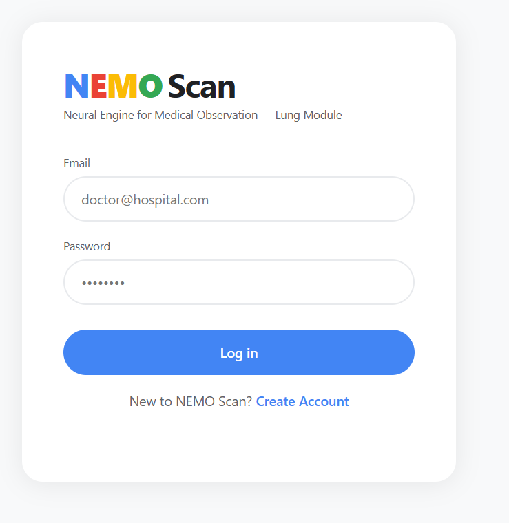
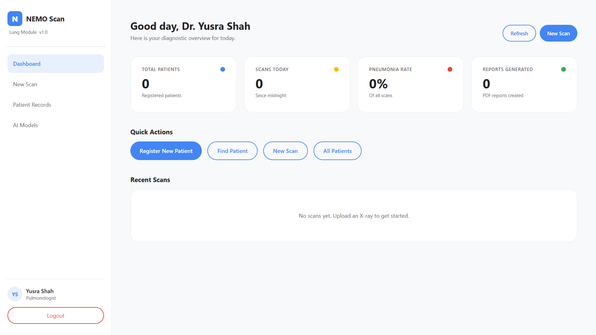
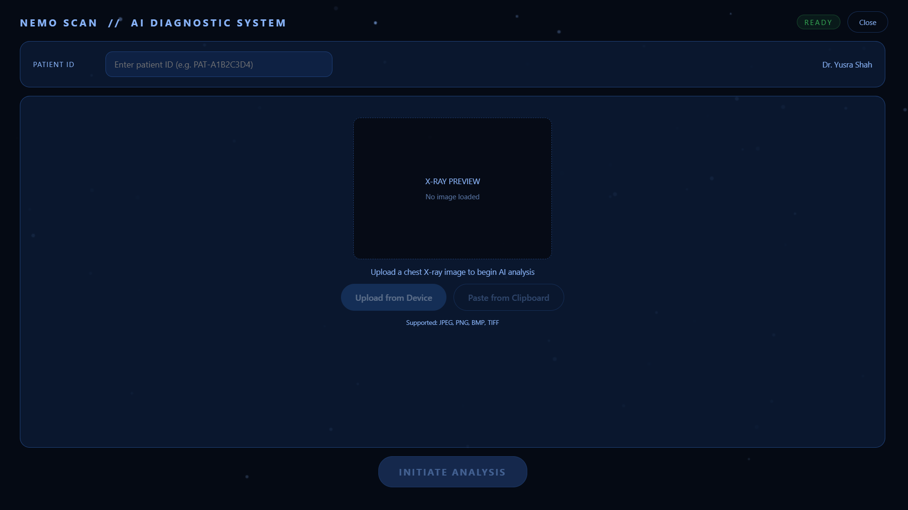
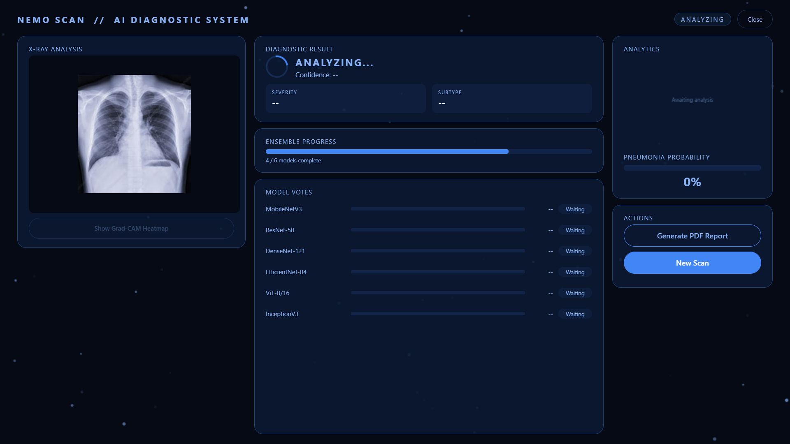
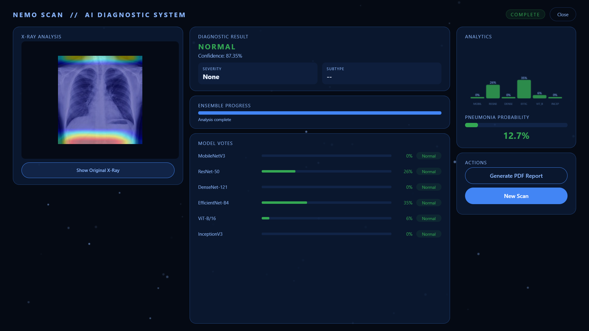
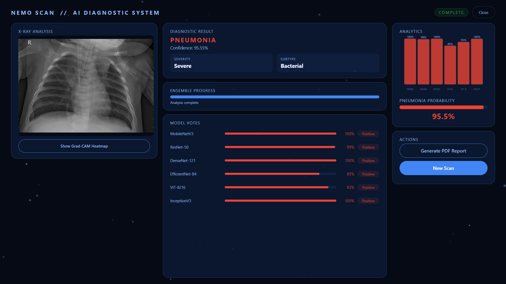
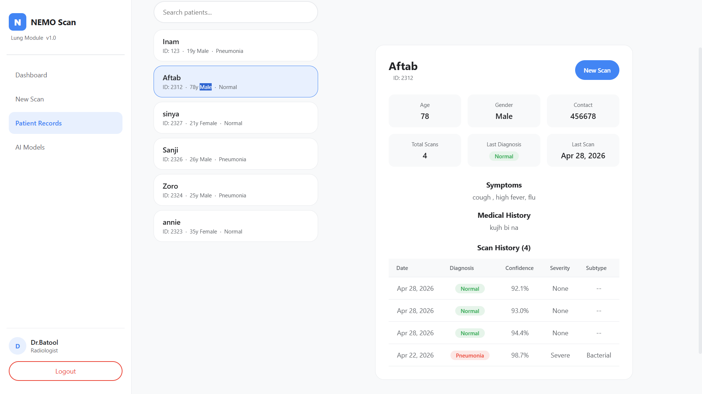
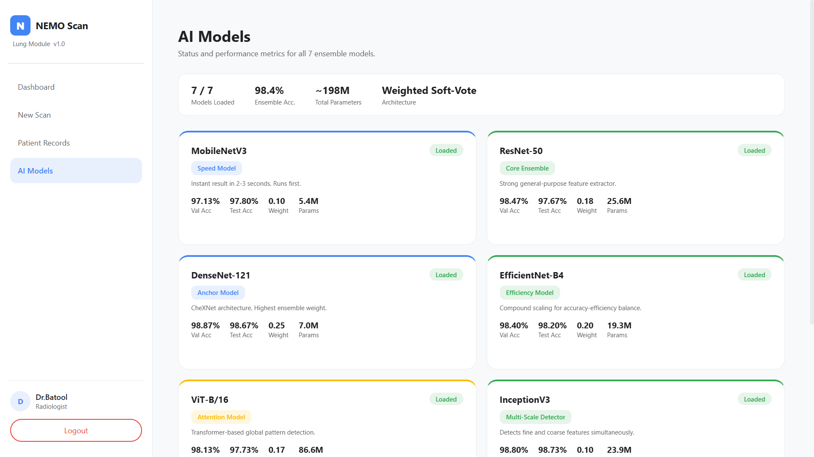
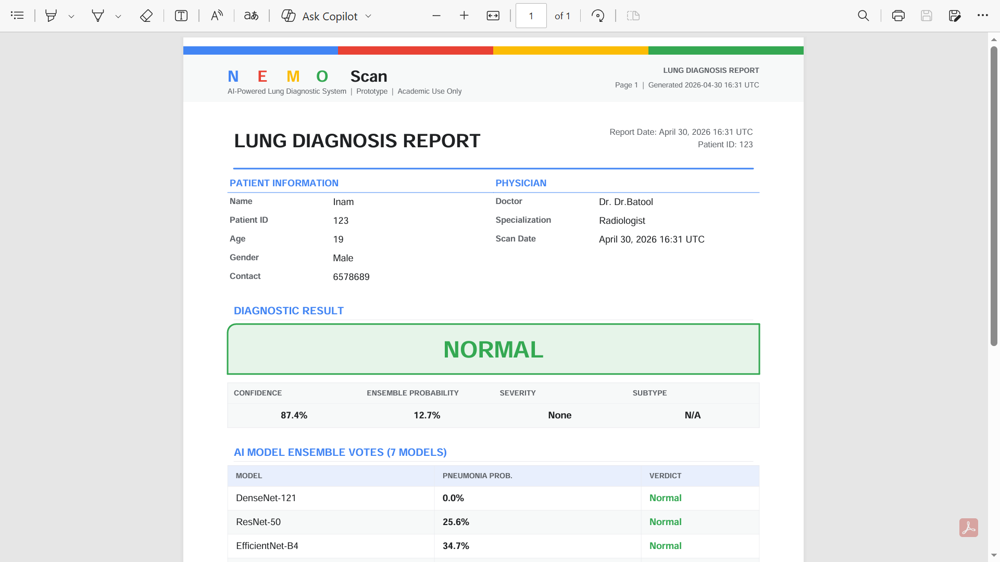

# PneumoScan

**AI-powered pneumonia detection from chest X-rays. 7 deep learning models. Real ensemble inference. Built end-to-end in Python.**

> Live Demo: [https://yusra-shah--pneumo-scan-serve.modal.run](https://yusra-shah--pneumo-scan-serve.modal.run)
> GitHub: [https://github.com/Yusra-Shah/Pneumo-Scan](https://github.com/Yusra-Shah/Pneumo-Scan)

---

## What it does

A doctor logs in, registers a patient, and uploads a chest X-ray. PneumoScan runs the image through a 7-model ensemble and returns a diagnosis in seconds. Every model votes independently. Results show confidence, severity, subtype, and a Grad-CAM heatmap highlighting exactly which lung regions the AI examined. A bilingual PDF report (English + Urdu) is generated and saved per patient.

This is not a demo with hardcoded outputs. Every result comes from real PyTorch inference on trained weights.

---

## Screenshots

### Login


### Dashboard


### Scan Upload


### Analyzing in real time


### Normal result with Grad-CAM heatmap


### Pneumonia detected — Severe, Bacterial, 95.55% confidence


### Patient Records


### Patient Profile with full scan history


### AI Models Panel — all 7 loaded


### Generated PDF Report


---

## Models

7 deep learning models trained on 15,000 chest X-rays (Kermany + NIH ChestX-ray14 + Albumentations augmentation). Weighted soft-vote ensemble. All weights are float16 for deployment efficiency.

| Model | Role | Val Acc | Test Acc | Weight |
|---|---|---|---|---|
| DenseNet-121 | Anchor (CheXNet architecture) | 98.87% | 98.67% | 0.25 |
| InceptionV3 | Multi-scale feature detection | 98.80% | 98.73% | 0.10 |
| AttentionCNN | Grad-CAM explainability | 98.67% | 98.13% | 0.00 |
| EfficientNet-B4 | Efficiency and accuracy balance | 98.40% | 98.20% | 0.20 |
| ViT-B/16 | Global pattern detection (Transformer) | 98.13% | 97.73% | 0.17 |
| ResNet-50 | General-purpose feature extractor | 98.47% | 97.67% | 0.18 |
| MobileNetV3 | Speed model, runs first | 97.13% | 97.80% | 0.10 |

Ensemble accuracy: **98.4%**

---

## Features

- Real bcrypt authentication against MongoDB Atlas doctors collection
- Patient registration and full medical history tracking
- Scan analysis with per-model vote breakdown
- Grad-CAM heatmap overlay showing which regions triggered the diagnosis
- Severity grading: None / Mild / Moderate / Severe
- Subtype classification: Bacterial or Viral
- Bilingual PDF report generation (English + Urdu) via ReportLab
- All scan records stored per patient in MongoDB with nested document structure
- MongoDB transactions and audit logging for DBMS compliance

---

## Stack

| Layer | Technology |
|---|---|
| GUI | PySide6 6.6.1, Material You design system |
| Deep learning | PyTorch 2.1.0, timm 0.9.7 |
| Explainability | grad-cam 1.4.8, OpenCV |
| Database | MongoDB Atlas (transactions, nested docs, audit log) |
| Reports | ReportLab 4.3.0 |
| Deployment | Modal (serverless GPU), float16 weights |
| Auth | bcrypt, session management |

---

## Dataset

15,000 balanced chest X-ray images. 7,500 Normal, 7,500 Pneumonia.

- Kaggle Kermany dataset (real images)
- NIH ChestX-ray14 (No Finding label, filtered via CSV)
- Albumentations augmentation pipeline (CLAHE, elastic distortion, Gaussian noise, rotation, flip, brightness/contrast)

Split: 80% train / 10% val / 10% test, stratified.

---

## Project Structure

```
Pneumo/
  core/
    inference/engine.py       Ensemble inference engine
    report_generator.py       Bilingual PDF generation
    gradcam.py                Grad-CAM heatmap logic
  gui/
    main_window.py
    dashboard.py
    scan_panel.py
    patients_panel.py
    models_panel.py
    styles.py                 Full Material You stylesheet
  database/                   MongoDB Atlas integration
  domains/lung/               Dataset and domain scaffold
  weights/lung/               Trained .pth files (float16)
  outputs/
    reports/                  Generated PDFs
    heatmaps/                 Saved Grad-CAM overlays
  training/                   Training scripts, augmentation pipeline
  modal_app.py                Modal serverless deployment
  main.py                     Entry point
```

---

## Run locally

```bash
git clone https://github.com/Yusra-Shah/Pneumo-Scan.git
cd Pneumo-Scan
python -m venv nemo_env
nemo_env\Scripts\activate
pip install -r requirements.txt
python main.py
```

Requires Python 3.12. MongoDB Atlas URI in config.yaml or environment variable.

---

## Context

Built as an internship portfolio project and Advanced DBMS course project at Sukkur IBA University. The architecture uses a domain registry pattern designed to support future expansion into cornea analysis and bone fracture detection without modifying existing code.

This is the lung module. The full multi-domain platform (NEMO Scan) is planned for development.

---

*Solo project by Yusra Shah*
